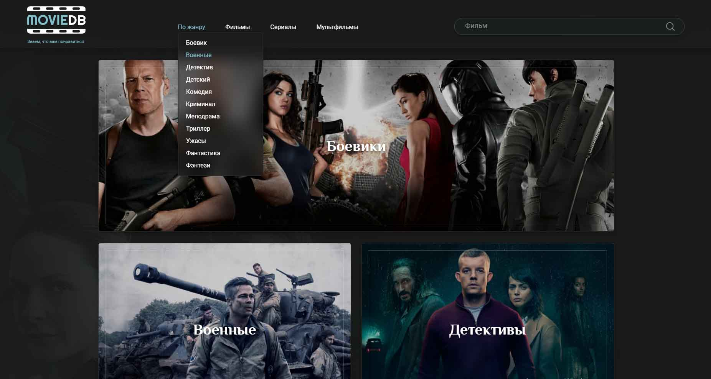

# Pet project "MovieDB" (проект в процессе разработки)

#### Посмотреть проект в браузере: https://annakrasnovid.github.io/moviedb/

## Описание:
**MovieDB** -это приложение,где можно искать фильмы по названию, жанру.

## Функциональность:


## Используемые технологии:
* HTML
* CSS
* React.js: 18
* react-router-dom: 6
* [Swiper](https://swiperjs.com/)
* JavaScript
* Flexbox
* Grid Layout

### Скриншот
</a>&nbsp;

## Инструкция по установке:
Клонируем репозиторий:
```
git clone https://github.com/AnnaKrasnovid/moviedb.git
```
Переходим в папку проекта:
```
cd movied
```
Устанавливаем зависимости:
```
npm install
```
Запускаем проект на компьютере:
```
npm run start
```
